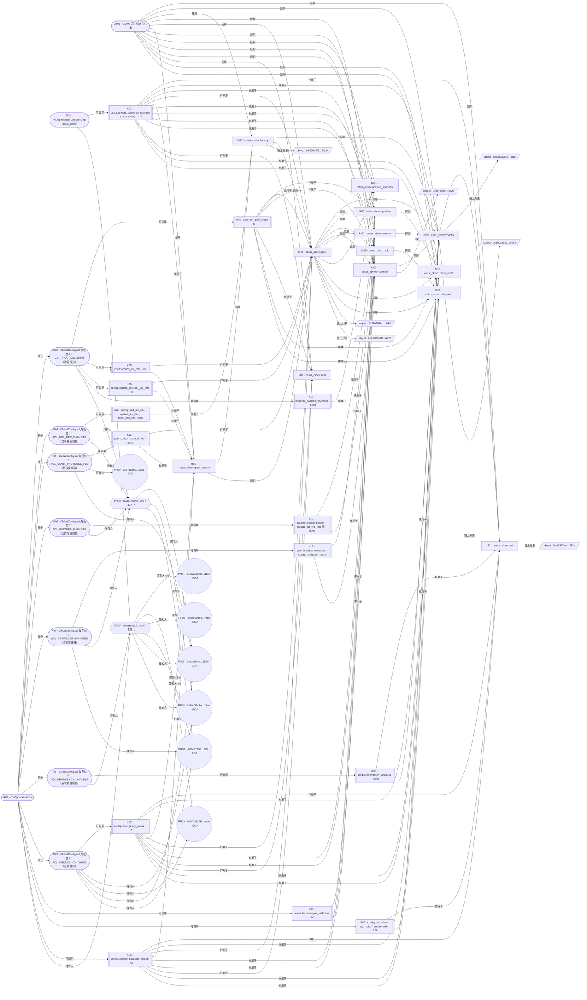

# 链上角色关系图（脚本生成，不要手改）

在前期准备的模块—角色—控制关系上，补充了链上实体：模块对应的顶层对象、角色的持有人、多签和时间锁的成员。同一个链上实体只有一个节点。

```mermaid
flowchart LR
  N0(["BZ01 · CLMM 原生做市与兑换"])
  N1["M01 · cetus_clmm::acl"]
  N2["M02 · cetus_clmm::config"]
  N3["M03 · cetus_clmm::factory"]
  N4["M04 · cetus_clmm::partner"]
  N5["M05 · cetus_clmm::pool"]
  N6["M06 · cetus_clmm::pool_creator"]
  N7["M07 · cetus_clmm::position"]
  N8["M08 · cetus_clmm::position_snapshot"]
  N9["M09 · cetus_clmm::rewarder"]
  N10["M10 · cetus_clmm::tick"]
  N11["M11 · cetus_clmm::utils"]
  N12["M12 · cetus_clmm::clmm_math"]
  N13["M13 · cetus_clmm::tick_math"]
  N14(["R01 · config::AdminCap"])
  N15(["R02 · 0x2::package::UpgradeCap（cetus_clmm）"])
  N16(["R03 · GlobalConfig.acl 角色位 0：ACL_POOL_MANAGER（池管理员）"])
  N17(["R04 · GlobalConfig.acl 角色位 1：ACL_FEE_TIER_MANAGER（费率档管理员）"])
  N18(["R05 · GlobalConfig.acl 角色位 2：ACL_CLAIM_PROTOCOL_FEE（协议费领取）"])
  N19(["R06 · GlobalConfig.acl 角色位 3：ACL_PARTNER_MANAGER（合作方管理员）"])
  N20(["R07 · GlobalConfig.acl 角色位 4：ACL_REWARDER_MANAGER（奖励管理员）"])
  N21(["R08 · GlobalConfig.acl 角色位 5：ACL_EMERGENCY_UNPAUSE（解除紧急暂停）"])
  N22(["R09 · GlobalConfig.acl 角色位 6：ACL_EMERGENCY_PAUSE（紧急暂停）"])
  N23[["K01 · 0x2::package::authorize_upgrade（cetus_clmm） · H1"]]
  N24[["K02 · rewarder::emergent_withdraw · H1"]]
  N25[["K03 · config::set_roles／add_role／remove_role · H3"]]
  N26[["K04 · config::update_package_version · H3"]]
  N27[["K05 · pool::set_pool_status · H3"]]
  N28[["K06 · pool::update_fee_rate · H2"]]
  N29[["K07 · config::emergency_pause · H3"]]
  N30[["K08 · config::emergency_unpause · none"]]
  N31[["K09 · config::update_protocol_fee_rate · H2"]]
  N32[["K10 · pool::initialize_rewarder／update_emission · none"]]
  N33[["K11 · pool::collect_protocol_fee · none"]]
  N34[["K12 · config::add_fee_tier／update_fee_tier／delete_fee_tier · none"]]
  N35[["K13 · partner::create_partner／update_ref_fee_rate 等 · none"]]
  N36[["K14 · pool::init_position_snapshot · none"]]
  N37[/"object · 0x260693ec…f084"/]
  N38[/"object · 0xdaa46292…3d8f"/]
  N39[/"object · 0x89c1a321…6a75"/]
  N40[/"object · 0xcf1897ae…764c"/]
  N41[/"object · 0xf699e7f2…98d0"/]
  N42[/"object · 0xce7bceef…8f2b"/]
  N43[/"object · 0x4462a572…a274"/]
  N44(("PR01 · 0xda7e6003…d113 · EOA"))
  N45(("PR02 · 0x94718229…ab9c · EOA"))
  N46(("PR03 · 0xd2029d6d…f9b8 · EOA"))
  N47(("PR04 · 0xf5c57356…5f9f · EOA"))
  N48(("PR05 · 0xaabf2fed…1580 · EOA"))
  N49(("PR06 · 0x69d3948e…18ee · EOA"))
  N50{{"PR07 · 0xdbfd0b17…4a47 · 多签 5"}}
  N51{{"PR08 · 0x2891c6b8…2c47 · 多签 2"}}
  N52(("PR09 · 0x2713eff5…9c81 · EOA"))
  N0 -->|使用| N1
  N0 -->|使用| N2
  N2 -->|调用| N1
  N0 -->|使用| N3
  N3 -->|调用| N2
  N3 -->|调用| N5
  N0 -->|使用| N4
  N4 -->|调用| N2
  N0 -->|使用| N5
  N5 -->|调用| N2
  N5 -->|调用| N7
  N5 -->|调用| N10
  N5 -->|调用| N9
  N5 -->|调用| N4
  N5 -->|调用| N8
  N5 -->|调用| N12
  N5 -->|调用| N13
  N0 -->|使用| N6
  N6 -->|调用| N3
  N6 -->|调用| N5
  N0 -->|使用| N7
  N7 -->|调用| N12
  N0 -->|使用| N8
  N0 -->|使用| N9
  N9 -->|调用| N2
  N0 -->|使用| N10
  N10 -->|调用| N13
  N0 -->|使用| N11
  N0 -->|使用| N12
  N0 -->|使用| N13
  N14 -->|授予| N16
  N14 -->|授予| N17
  N14 -->|授予| N18
  N14 -->|授予| N19
  N14 -->|授予| N20
  N14 -->|授予| N21
  N14 -->|授予| N22
  N15 -->|可调用| N23
  N23 -->|作用于| N1
  N23 -->|作用于| N2
  N23 -->|作用于| N4
  N23 -->|作用于| N5
  N23 -->|作用于| N6
  N23 -->|作用于| N7
  N23 -->|作用于| N8
  N23 -->|作用于| N9
  N23 -->|作用于| N10
  N23 -->|作用于| N11
  N23 -->|作用于| N12
  N23 -->|作用于| N13
  N14 -->|可调用| N24
  N24 -->|作用于| N4
  N24 -->|作用于| N9
  N14 -->|可调用| N25
  N25 -->|作用于| N1
  N25 -->|作用于| N2
  N14 -->|可调用| N26
  N26 -->|作用于| N1
  N26 -->|作用于| N2
  N26 -->|作用于| N5
  N26 -->|作用于| N6
  N26 -->|作用于| N7
  N26 -->|作用于| N10
  N26 -->|作用于| N11
  N26 -->|作用于| N12
  N26 -->|作用于| N13
  N16 -->|可调用| N27
  N27 -->|作用于| N5
  N27 -->|作用于| N7
  N27 -->|作用于| N10
  N27 -->|作用于| N11
  N27 -->|作用于| N12
  N27 -->|作用于| N13
  N16 -->|可调用| N28
  N28 -->|作用于| N5
  N28 -->|作用于| N6
  N22 -->|可调用| N29
  N29 -->|作用于| N1
  N29 -->|作用于| N2
  N29 -->|作用于| N5
  N29 -->|作用于| N6
  N29 -->|作用于| N7
  N29 -->|作用于| N10
  N29 -->|作用于| N11
  N29 -->|作用于| N12
  N29 -->|作用于| N13
  N21 -->|可调用| N30
  N30 -->|作用于| N1
  N30 -->|作用于| N2
  N16 -->|可调用| N31
  N31 -->|作用于| N5
  N31 -->|作用于| N6
  N20 -->|可调用| N32
  N32 -->|作用于| N4
  N32 -->|作用于| N9
  N18 -->|可调用| N33
  N33 -->|作用于| N5
  N33 -->|作用于| N6
  N17 -->|可调用| N34
  N34 -->|作用于| N3
  N19 -->|可调用| N35
  N35 -->|作用于| N4
  N35 -->|作用于| N9
  N16 -->|可调用| N36
  N36 -->|作用于| N8
  N5 -->|链上对象| N37
  N2 -->|链上对象| N38
  N2 -->|链上对象| N39
  N1 -->|链上对象| N40
  N3 -->|链上对象| N41
  N9 -->|链上对象| N42
  N5 -->|链上对象| N43
  N50 -->|签名人 w3| N44
  N50 -->|签名人 w3| N45
  N50 -->|签名人| N46
  N50 -->|签名人| N47
  N50 -->|签名人| N48
  N50 -->|签名人| N49
  N51 -->|签名人| N48
  N51 -->|签名人| N49
  N51 -->|签名人| N47
  N14 -->|持有人| N50
  N15 -->|持有人| N50
  N16 -->|持有人| N51
  N17 -->|持有人| N51
  N18 -->|持有人| N52
  N18 -->|持有人| N48
  N19 -->|持有人| N51
  N20 -->|持有人| N51
  N20 -->|持有人| N47
  N21 -->|持有人| N50
  N22 -->|持有人| N49
  N22 -->|持有人| N45
  N22 -->|持有人| N48
  N22 -->|持有人| N47
```
