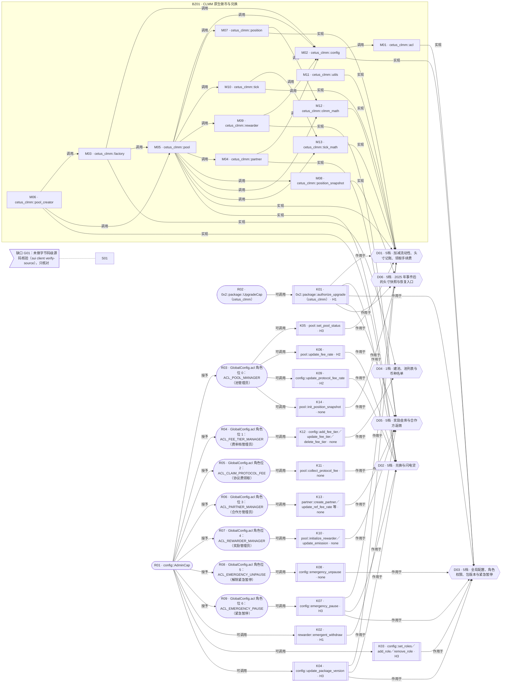

# 全量关系图（脚本生成，不要手改）

```mermaid
flowchart LR
  subgraph BZ01["BZ01 · CLMM 原生做市与兑换"]
    M01["M01 · cetus_clmm::acl"]
    M02["M02 · cetus_clmm::config"]
    M03["M03 · cetus_clmm::factory"]
    M04["M04 · cetus_clmm::partner"]
    M05["M05 · cetus_clmm::pool"]
    M06["M06 · cetus_clmm::pool_creator"]
    M07["M07 · cetus_clmm::position"]
    M08["M08 · cetus_clmm::position_snapshot"]
    M09["M09 · cetus_clmm::rewarder"]
    M10["M10 · cetus_clmm::tick"]
    M11["M11 · cetus_clmm::utils"]
    M12["M12 · cetus_clmm::clmm_math"]
    M13["M13 · cetus_clmm::tick_math"]
  end
  M02 -->|调用| M01
  M03 -->|调用| M02
  M03 -->|调用| M05
  M04 -->|调用| M02
  M05 -->|调用| M02
  M05 -->|调用| M07
  M05 -->|调用| M10
  M05 -->|调用| M09
  M05 -->|调用| M04
  M05 -->|调用| M08
  M05 -->|调用| M12
  M05 -->|调用| M13
  M06 -->|调用| M03
  M06 -->|调用| M05
  M07 -->|调用| M12
  M09 -->|调用| M02
  M10 -->|调用| M13
  D01{{"D01 · 5档 · 加减流动性、头寸记账、领取手续费"}}
  M05 -->|实现| D01
  M07 -->|实现| D01
  M10 -->|实现| D01
  M12 -->|实现| D01
  M13 -->|实现| D01
  M11 -->|实现| D01
  D02{{"D02 · 5档 · 兑换与闪电贷"}}
  M05 -->|实现| D02
  M06 -->|实现| D02
  D03{{"D03 · 5档 · 全局配置、角色权限、包版本与紧急暂停"}}
  M02 -->|实现| D03
  M01 -->|实现| D03
  D04{{"D04 · 1档 · 建池、池列表与币种名单"}}
  M03 -->|实现| D04
  D05{{"D05 · 5档 · 奖励金库与合作方返佣"}}
  M09 -->|实现| D05
  M04 -->|实现| D05
  D06{{"D06 · 5档 · 2025 年事件后的头寸快照与恢复入口"}}
  M08 -->|实现| D06
  R01(["R01 · config::AdminCap"])
  R02(["R02 · 0x2::package::UpgradeCap（cetus_clmm）"])
  R03(["R03 · GlobalConfig.acl 角色位 0：ACL_POOL_MANAGER（池管理员）"])
  R01 -->|授予| R03
  R04(["R04 · GlobalConfig.acl 角色位 1：ACL_FEE_TIER_MANAGER（费率档管理员）"])
  R01 -->|授予| R04
  R05(["R05 · GlobalConfig.acl 角色位 2：ACL_CLAIM_PROTOCOL_FEE（协议费领取）"])
  R01 -->|授予| R05
  R06(["R06 · GlobalConfig.acl 角色位 3：ACL_PARTNER_MANAGER（合作方管理员）"])
  R01 -->|授予| R06
  R07(["R07 · GlobalConfig.acl 角色位 4：ACL_REWARDER_MANAGER（奖励管理员）"])
  R01 -->|授予| R07
  R08(["R08 · GlobalConfig.acl 角色位 5：ACL_EMERGENCY_UNPAUSE（解除紧急暂停）"])
  R01 -->|授予| R08
  R09(["R09 · GlobalConfig.acl 角色位 6：ACL_EMERGENCY_PAUSE（紧急暂停）"])
  R01 -->|授予| R09
  K01[["K01 · 0x2::package::authorize_upgrade（cetus_clmm） · H1"]]
  R02 -->|可调用| K01
  K01 -->|作用于| D01
  K01 -->|作用于| D02
  K01 -->|作用于| D03
  K01 -->|作用于| D05
  K01 -->|作用于| D06
  K02[["K02 · rewarder::emergent_withdraw · H1"]]
  R01 -->|可调用| K02
  K02 -->|作用于| D05
  K03[["K03 · config::set_roles／add_role／remove_role · H3"]]
  R01 -->|可调用| K03
  K03 -->|作用于| D03
  K04[["K04 · config::update_package_version · H3"]]
  R01 -->|可调用| K04
  K04 -->|作用于| D01
  K04 -->|作用于| D02
  K04 -->|作用于| D03
  K05[["K05 · pool::set_pool_status · H3"]]
  R03 -->|可调用| K05
  K05 -->|作用于| D01
  K06[["K06 · pool::update_fee_rate · H2"]]
  R03 -->|可调用| K06
  K06 -->|作用于| D02
  K07[["K07 · config::emergency_pause · H3"]]
  R09 -->|可调用| K07
  K07 -->|作用于| D01
  K07 -->|作用于| D02
  K07 -->|作用于| D03
  K08[["K08 · config::emergency_unpause · none"]]
  R08 -->|可调用| K08
  K08 -->|作用于| D03
  K09[["K09 · config::update_protocol_fee_rate · H2"]]
  R03 -->|可调用| K09
  K09 -->|作用于| D02
  K10[["K10 · pool::initialize_rewarder／update_emission · none"]]
  R07 -->|可调用| K10
  K10 -->|作用于| D05
  K11[["K11 · pool::collect_protocol_fee · none"]]
  R05 -->|可调用| K11
  K11 -->|作用于| D02
  K12[["K12 · config::add_fee_tier／update_fee_tier／delete_fee_tier · none"]]
  R04 -->|可调用| K12
  K12 -->|作用于| D04
  K13[["K13 · partner::create_partner／update_ref_fee_rate 等 · none"]]
  R06 -->|可调用| K13
  K13 -->|作用于| D05
  K14[["K14 · pool::init_position_snapshot · none"]]
  R03 -->|可调用| K14
  K14 -->|作用于| D06
  G01>"缺口 G01：未做字节码级源码核验（sui client verify-source），只核对"]
  G01 -.- S01
```
