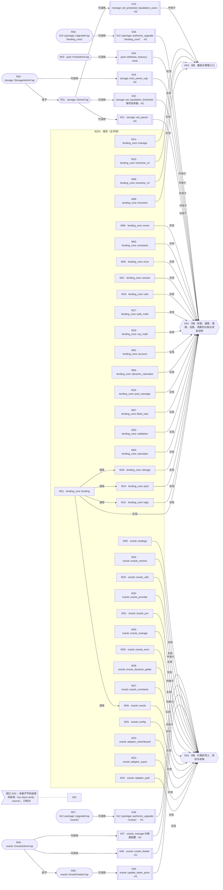

# 全量关系图（脚本生成，不要手改）

```mermaid
flowchart LR
  subgraph BZ01["BZ01 · 借贷（主市场）"]
    M01["M01 · lending_core::account"]
    M02["M02 · lending_core::calculator"]
    M03["M03 · lending_core::constants"]
    M04["M04 · lending_core::dynamic_calculator"]
    M05["M05 · lending_core::error"]
    M06["M06 · lending_core::event"]
    M07["M07 · lending_core::flash_loan"]
    M08["M08 · lending_core::incentive"]
    M09["M09 · lending_core::incentive_v2"]
    M10["M10 · lending_core::incentive_v3"]
    M11["M11 · lending_core::lending"]
    M12["M12 · lending_core::logic"]
    M13["M13 · lending_core::manage"]
    M14["M14 · lending_core::pool"]
    M15["M15 · lending_core::pool_manager"]
    M16["M16 · lending_core::ray_math"]
    M17["M17 · lending_core::safe_math"]
    M18["M18 · lending_core::storage"]
    M19["M19 · lending_core::utils"]
    M20["M20 · lending_core::validation"]
    M21["M21 · lending_core::version"]
    M22["M22 · oracle::adaptor_pyth"]
    M23["M23 · oracle::adaptor_supra"]
    M24["M24 · oracle::adaptor_switchboard"]
    M25["M25 · oracle::config"]
    M26["M26 · oracle::oracle"]
    M27["M27 · oracle::oracle_constants"]
    M28["M28 · oracle::oracle_dynamic_getter"]
    M29["M29 · oracle::oracle_error"]
    M30["M30 · oracle::oracle_manage"]
    M31["M31 · oracle::oracle_pro"]
    M32["M32 · oracle::oracle_provider"]
    M33["M33 · oracle::oracle_utils"]
    M34["M34 · oracle::oracle_version"]
    M35["M35 · oracle::strategy"]
  end
  M11 -->|调用| M12
  M11 -->|调用| M14
  M11 -->|调用| M18
  M11 -->|调用| M26
  D01{{"D01 · 5档 · 存款、提款、借款、还款、清算的记账与资金划转"}}
  M11 -->|实现| D01
  M12 -->|实现| D01
  M14 -->|实现| D01
  M18 -->|实现| D01
  M02 -->|实现| D01
  M20 -->|实现| D01
  M07 -->|实现| D01
  M15 -->|实现| D01
  M04 -->|实现| D01
  M01 -->|实现| D01
  M16 -->|实现| D01
  M17 -->|实现| D01
  M19 -->|实现| D01
  M21 -->|实现| D01
  M05 -->|实现| D01
  M03 -->|实现| D01
  M06 -->|实现| D01
  D02{{"D02 · 5档 · 价格的写入、校验与读取"}}
  M22 -->|实现| D02
  M23 -->|实现| D02
  M24 -->|实现| D02
  M25 -->|实现| D02
  M26 -->|实现| D02
  M27 -->|实现| D02
  M28 -->|实现| D02
  M29 -->|实现| D02
  M30 -->|实现| D02
  M31 -->|实现| D02
  M32 -->|实现| D02
  M33 -->|实现| D02
  M34 -->|实现| D02
  M35 -->|实现| D02
  D03{{"D03 · 5档 · 激励与管理入口"}}
  M08 -->|实现| D03
  M09 -->|实现| D03
  M10 -->|实现| D03
  M13 -->|实现| D03
  R01(["R01 · storage::OwnerCap"])
  R02 -->|授予| R01
  R02(["R02 · storage::StorageAdminCap"])
  R03(["R03 · pool::PoolAdminCap"])
  R04(["R04 · oracle::OracleAdminCap"])
  R05(["R05 · oracle::OracleFeederCap"])
  R04 -->|授予| R05
  R06(["R06 · 0x2::package::UpgradeCap（lending_core）"])
  R07(["R07 · 0x2::package::UpgradeCap（oracle）"])
  K01[["K01 · storage::set_pause · H3"]]
  R01 -->|可调用| K01
  K01 -->|作用于| D01
  K02[["K02 · storage::set_liquidation_threshold 等风险参数 · H2"]]
  R01 -->|可调用| K02
  K02 -->|作用于| D01
  K03[["K03 · storage::mint_owner_cap · H2"]]
  R02 -->|可调用| K03
  K03 -->|作用于| D01
  K04[["K04 · pool::withdraw_treasury · none"]]
  R03 -->|可调用| K04
  K04 -->|作用于| D01
  K05[["K05 · oracle::update_token_price · H1"]]
  R05 -->|可调用| K05
  K05 -->|作用于| D02
  K06[["K06 · oracle::create_feeder · H1"]]
  R04 -->|可调用| K06
  K06 -->|作用于| D02
  K07[["K07 · oracle_manage 价格源配置 · H2"]]
  R04 -->|可调用| K07
  K07 -->|作用于| D02
  K08[["K08 · 0x2::package::authorize_upgrade（lending_core） · H1"]]
  R06 -->|可调用| K08
  K08 -->|作用于| D01
  K09[["K09 · 0x2::package::authorize_upgrade（oracle） · H1"]]
  R07 -->|可调用| K09
  K09 -->|作用于| D02
  K10[["K10 · manage::set_protected_liquidation_users · H3"]]
  R01 -->|可调用| K10
  K10 -->|作用于| D03
  G01>"缺口 G01：未做字节码级源码核验（sui client verify-source），只核对"]
  G01 -.- S01
```
